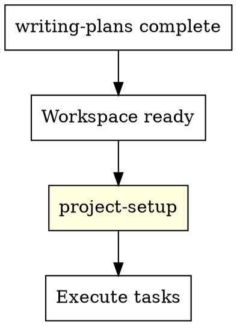

# Project Setup

Generate a CLAUDE.md for the target project so all subsequent agents (including subagents) inherit project conventions.

## When to Use

**After** the workspace is ready (worktree created or current branch selected) and **before** implementation begins. This is the bridge between planning and execution.



## The Process

### Step 1: Gather Context

Read the following sources (in order of priority):

1. **Existing CLAUDE.md** — if the project already has one, read it first. You're extending, not replacing.
2. **Spec document** — extract architecture decisions, tech stack, naming conventions
3. **Plan document** — extract file structure, testing strategy, dependency choices
4. **`.superpowers.yml`** — extract TDD mode, review preferences, paths
5. **Project files** — scan `package.json`, `tsconfig.json`, `.eslintrc`, `pyproject.toml`, `Cargo.toml`, etc. for existing conventions

### Step 2: Generate CLAUDE.md

Create or update `CLAUDE.md` in the project root (or worktree root).

**If CLAUDE.md already exists:** Append a new section rather than overwriting. Preserve everything the user already wrote.

**If CLAUDE.md doesn't exist:** Generate from scratch using the template below.

### Template

```markdown
# CLAUDE.md

## Project Overview

{One paragraph describing what this project does, from the spec}

## Tech Stack

{List of technologies, frameworks, and key dependencies}

## Directory Structure

{Key directories and their purpose, from the plan's file map}

## Development Conventions

### Code Style
{Inferred from existing config files (.eslintrc, prettier, etc.) or from spec}

### Naming
{Naming conventions observed in the codebase or specified in the spec}

### Testing
{Based on .superpowers.yml tdd setting and spec's testing strategy}
- Test framework: {detected from package.json/pyproject.toml/etc.}
- TDD mode: {from .superpowers.yml — required/recommended/off}
- Test location: {convention from existing tests or plan}

## Build & Run

```bash
# Install dependencies
{detected command}

# Run tests
{detected command}

# Build
{detected command}

# Start development
{detected command}
```

## Architecture Notes

{Key architectural decisions from the spec that implementers need to know}

## Superpowers Config

- Mode: {from .superpowers.yml}
- TDD: {from .superpowers.yml}
- Reviews: {from .superpowers.yml}
- Spec: {path to spec document}
- Plan: {path to plan document}
```

### Step 3: Validate

After generating, do a quick sanity check:
- Are the build/run commands accurate? (check if they actually work)
- Does the directory structure match reality?
- Are there conflicts with existing CLAUDE.md content?

### Step 4: Commit

```bash
git add CLAUDE.md
git commit -m "docs: add CLAUDE.md with project conventions"
```

## Checklist

1. **Read existing context** — spec, plan, config, project files
2. **Check for existing CLAUDE.md** — extend, don't replace
3. **Generate CLAUDE.md** — using template, fill in from gathered context
4. **Validate** — check commands work, structure matches
5. **Commit** — so subagents can read it

## Key Rules

- **Never overwrite an existing CLAUDE.md.** Append or merge.
- **Only include what's useful for implementers.** No fluff, no restating the spec.
- **Commands must be accurate.** If you're not sure, test them first.
- **Keep it concise.** CLAUDE.md should be scannable, not a novel. Target 50-100 lines.
- **Respect `.superpowers.yml`.** If `auto_commit: false`, don't commit — tell the user it's ready for review.

## For Existing Projects

When working on an existing project that already has conventions:

- **Read the existing codebase** before generating — don't contradict established patterns
- **Focus on new information** — what does this feature/change add that the CLAUDE.md doesn't already cover?
- **Add a section, not a rewrite** — append "## {Feature Name} Notes" with relevant conventions

## Integration

**Called after:**
- using-git-worktrees — workspace is ready
- Or directly after writing-plans if `use_worktree: false`

**Called before:**
- subagent-driven-development — so subagents read CLAUDE.md
- executing-plans — so execution follows conventions

**Reads:**
- Spec document (from configured `paths.specs`)
- Plan document (from configured `paths.plans`)
- `.superpowers.yml`
- Existing project config files
