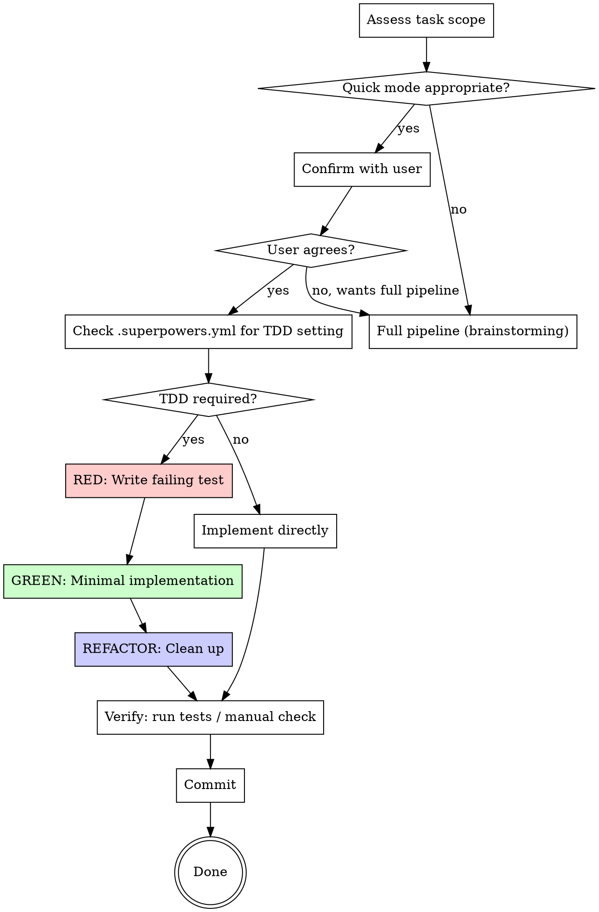

# Quick Mode

Fast-track small tasks without the full design pipeline.

## When to Use

**Use quick mode when ALL of these are true:**
- Task is small and well-defined (the user knows what they want)
- Touches ~3 or fewer files
- Estimated effort under 15 minutes
- No architectural decisions needed
- No ambiguity about requirements

**Examples that qualify:**
- Fix a specific bug with a known cause
- Rename a variable/function/file
- Update a config value
- Fix a typo or style issue
- Add a simple validation
- Update a dependency version
- Small refactor within a single module

**Examples that do NOT qualify (use full pipeline):**
- "Build a payment system"
- "Add user authentication"
- "Refactor the database layer"
- Any task where you'd need to ask 3+ clarifying questions
- Anything touching shared interfaces or APIs

## Configuration

Check `.superpowers.yml` in the project root for user preferences:
- `mode: quick` — always use quick mode (user chose this)
- `mode: full` — never use quick mode (go to brainstorming)
- `mode: auto` — you decide based on task complexity (default)
- `tdd` — whether TDD is required in quick mode
- `auto_commit` — whether to auto-commit
- `skip_review_in_quick_mode` — whether to skip code review

If no `.superpowers.yml` exists, use `mode: auto` with default settings.

## The Process

## Checklist

You MUST create a task for each of these items:

1. **Assess scope** — read relevant code, confirm task is small
2. **Confirm approach** — tell the user: "This looks like a quick task. I'll [describe what you'll do]. Want me to go ahead, or would you prefer the full design pipeline?"
3. **Implement** — follow TDD if configured, otherwise implement directly
4. **Verify** — run tests, confirm nothing is broken
5. **Commit** — commit with a clear message

## Key Rules

- **Always confirm with the user first.** Don't silently skip the full pipeline.
- **If it turns out to be bigger than expected, STOP.** Switch to the full pipeline immediately. Don't force a big task through quick mode.
- **Respect `.superpowers.yml` settings.** If `mode: full`, don't offer quick mode.
- **Still use verification-before-completion.** Quick doesn't mean sloppy.

## Escalation

If during implementation you discover:
- The task touches more files than expected
- There are architectural implications
- You need to ask multiple clarifying questions
- The fix is more complex than it appeared

**STOP immediately.** Tell the user:
> "This is more complex than it initially looked. I'd recommend switching to the full pipeline with brainstorming. Want me to do that?"

## Integration

**May skip:**
- brainstorming (no spec document needed)
- writing-plans (no plan document needed)
- using-git-worktrees (optional for small changes)
- spec-review and code-review (if `skip_review_in_quick_mode: true`)

**Still uses:**
- test-driven-development (if `tdd: required` or `tdd: recommended`)
- verification-before-completion (always)
- systematic-debugging (if debugging is needed)
